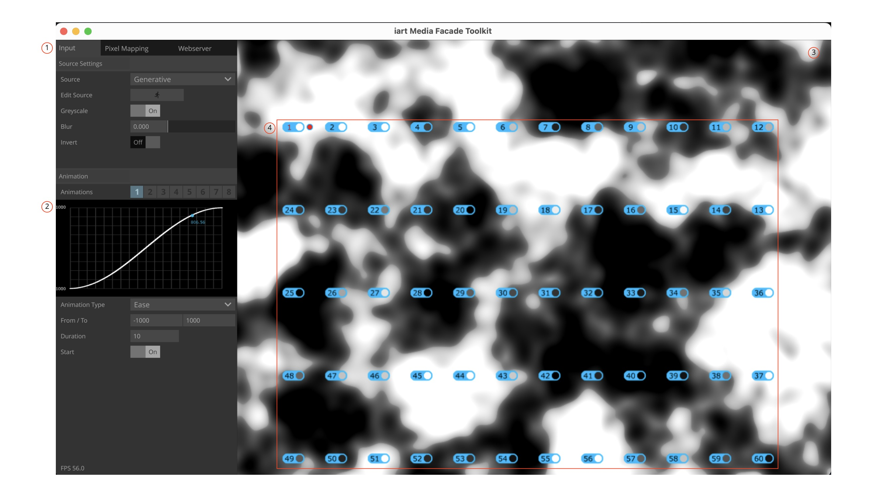
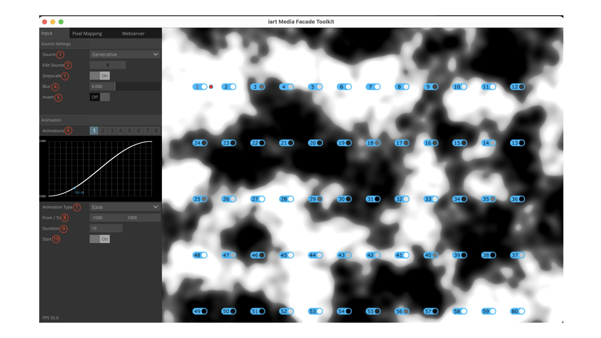
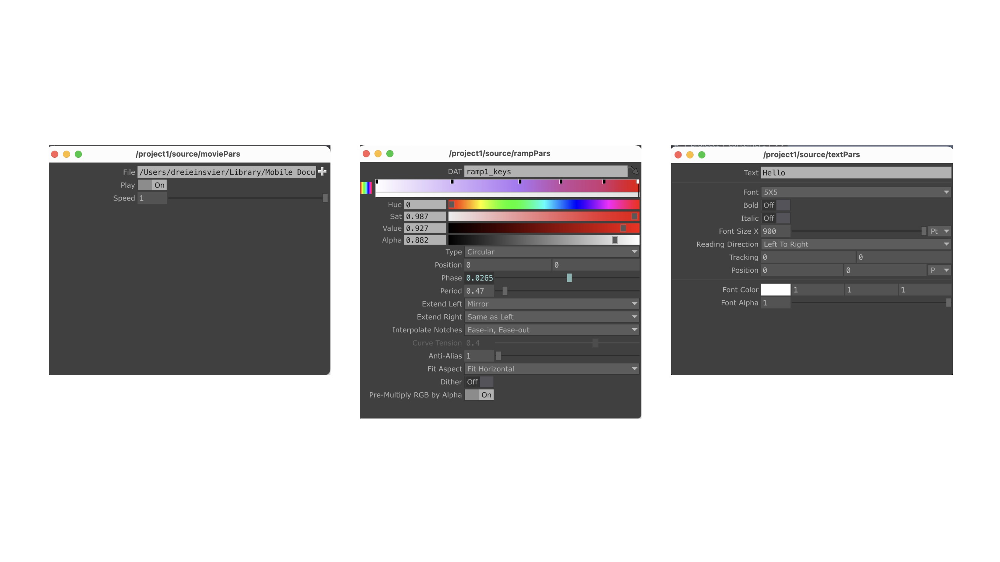
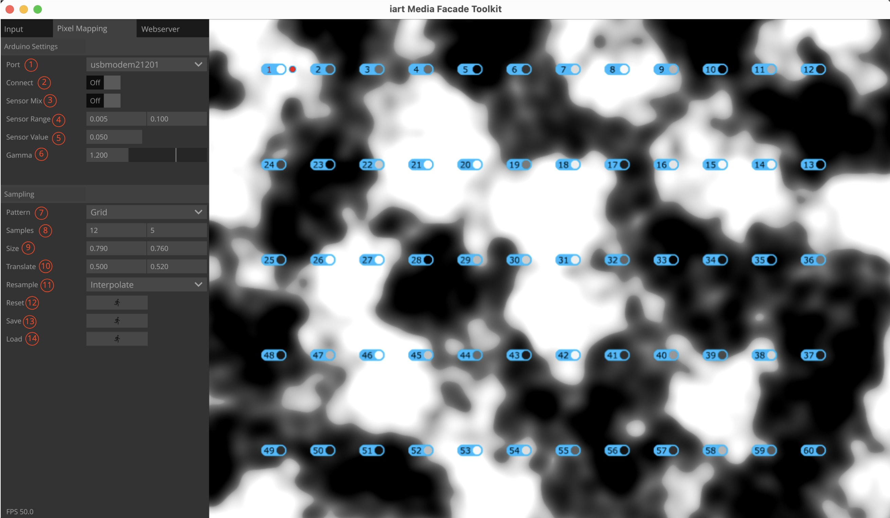
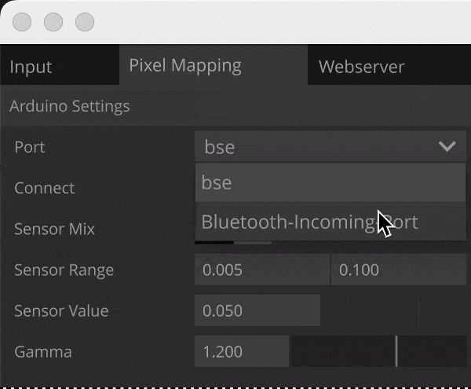
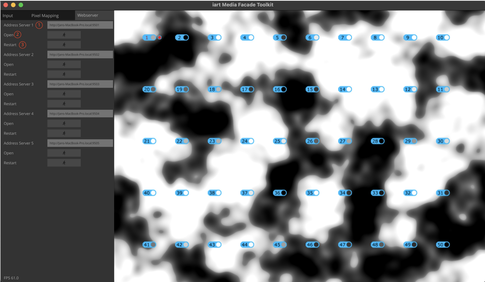

# Manual for the iart Media Facade Toolkit App

## The Interface

If the Interface gets lost, it can be opened via CTRL-o

**1.** The Main Navigation of the app. There are 3 tabs for Input, Pixel Mapping and Webserver. We will get into detail of all the options for each tab later. But here a little overview:

- Input: The Input tab is the source of content, that later will be shown on the led strip. it is dvided into two parts. Soure Settings and Animation. Available Sources are Generative (TouchDesigner Network), Text, Gradient and File. All of these Sources can be animated with values from the Animation section.

- Pixel Mapping: The Pixel Mapping section lets you create sample points ( as seen in **4** ), which will then be mapped to the individual led pixels of the led strip.

- Werserver: The Webserver section lets you stream five sampled pixels to 5 webservers, which can be opened for example on a mobile phone.

**2.** All the options for each tab section

**3.** Preview of the Source that is currently selected.

**4.** Sample points from the Pixel Mapping section. These points will be mapped to the led strip pixels

## Changing Values on the Fly

Some values can be modified interactively ( like a slider ) by pressing either **ALT + Right Mouse** or Middle Mouse into the field. A little pop up menu will appear that shows the precision. Select a precision by hovering over it and then drag your mouse left or right, to modify the value. This comes in handy when you want to experiment with certain values.

Values that can be modified like this are:

**Input**

- Blur
- From / To
- Duration

**Pixel Mapping**

- Sensor Range
- Gamma
- Samples
- Size
- Translate

## Detail Tab Section

Lets check out all the options in detail

### Input

**1.** The Source Dropdown Menu lets you select 1 of 4 Sources. Generative, Text, Gradient and File.

- Generative: This is more advanced and lets you program a TouchDesigner Network yourself.

- Text: Simple Text generator. Lets you create Text and animate it.

- Gradient: Gradient Generator

- File: Opens a Movie or Image File and shows it.

**2.** Pressing Edit Source will open a little pop up for the corresponding source selected in the Drop Down.

**3.** Greyscale: Makes the source monochrome

**4.** Blurs the source. Can be useful if you want to get the average color of a sampled pixel

**5.** Inverts the source.

**6.** Available Animation 8 in total can be referenced with $A1 - $A8 to animate values

**7.** Type of current animation curve

**8.** Sets the range of the current animation value from to.

**9.** Sets the duration of the current animation

**10.** Starts/Pauses the current animation

### Pixel Mapping

**1.** Select the port, the Arduino is connected to ( USB ). On MacOS the port should start with something like usbmodem... on Windows it should be something like COM... . To find this out, disconnect the USB of the Arduino. Open the Dropdown Menu and remember whats in the list. close the dropwdown menu by pressing somewhere. Connect the Arduino and open the dropdown menu again. The new entry is the port you have to select.

**2.** Toggle this when the Arduino is connect via USB and the correct port is selected

**3.** If toggled, the output of the light sensor is multiplied with the sampled pixels. Basically dimmes the leds accordingly to the light situation

**4.** Sets the range for the sensor. Should be rather low.

**5.** Shows the current sensor value. Can be references everywhere via $SENSOR

**6.** The gamma value for the leds. Default is 1.2

**7.** This sets the initial position of the samples. There are two different modes. Grid and Circle. The sample positions can also be moved with the mouse.

**8.** Sets the amount of samples in x and y coordinates. Second field ( y coordinates ) is only used when pattern is Grid, otherwise discarded.

**9.** Distance between the samples x and y.

**10.** Translates all samples left, right, up and down.

**11.** If there are less samples than actual led pixels, the number of samples get resampled to fit the 60 leds of the strip. Interpolation adds values between the first and the last sample. Repeat just repeats the given number samples to meet 60 leds.

**12.** Resets assigned webserver and mouse movement of the samples.

**13.** Saves the current positions of the samples.

**14.** Loads sample positions from a previous saved state.

### Webserver

**1.** The web address under which you can reach the sample.

**2.** Opens the address in your default browser. You can then copy the address and enter it for example in the browser in your phone. This only works if your phone and the computer are in the **SAME NETWORK**

**3.** Restarts the webserver. Use in case the image in the browser does not get updated.

Use the other options accordingly.

- **Webserver samples can be assigned by right clicking on the sample**

## Animation Example - Text

Here you see how to animate text based on one animation ( in this case Animation 1 = $A1 ).
As already explained every animation cann be referenced by $A1 - $A8

