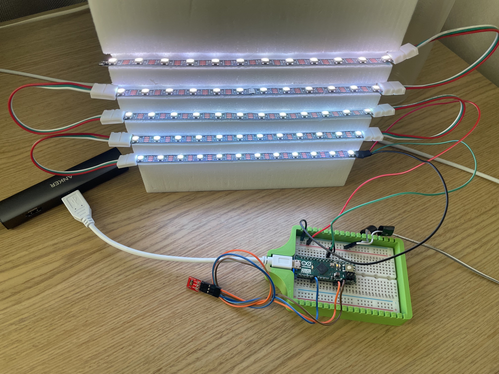

# [iart](https://www.iart.ch) Media Facade Toolkit

## Preamble

This repository contains all the files for the media facade workshop. The whole Toolkit consists out of an Arduino which has a light sensor and a led strip with 60 leds connected to it. The source code for the Arduino can be found under /Arduino. Furthermore you will find a TouchDesigner file in this repository which is the main app for exploring the Toolkit.

## Requirements

A installation of TouchDesigner and a license is needed to open the TouchDesigner file. To **get a license** please go to [derivative.ca](https://www.derivative.ca) and create an account. Your credentials from the derivative account can then be used to license TouchDesigner with a non commercial license for free.

## Using the app

Check out the manual under /docs

## Demo Video

You find a demo video here:

https://www.icloud.com/iclouddrive/0d9Qf84im7T-_4TpF3Leu94DA#Toolkit_Demo
